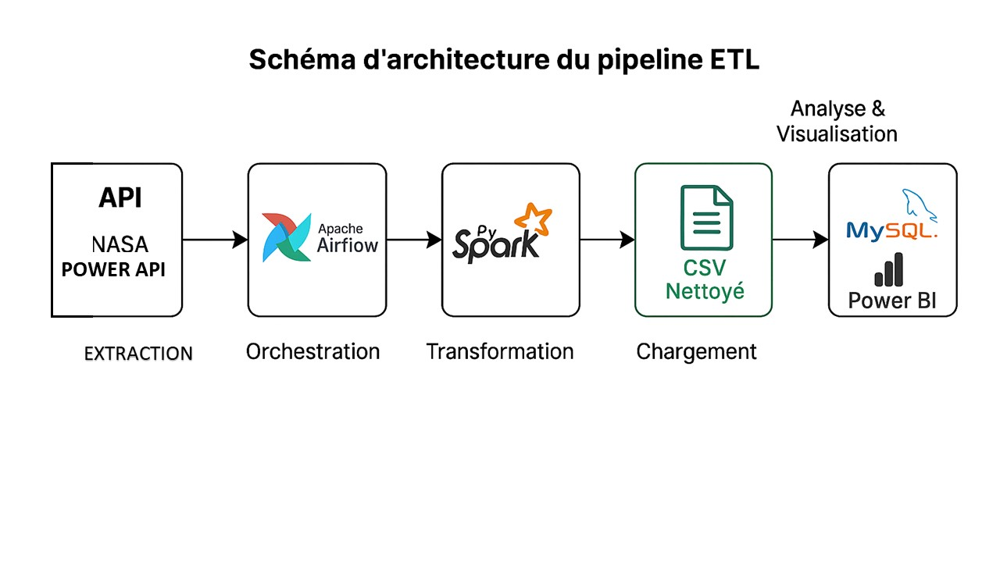

# 🌍 Projet E.T.L Météo NASA avec Airflow, Spark, MySQL et Analyse Météorologique

## 📌 Description : 

Ce projet met en place un **pipeline ETL automatisé** pour collecter, transformer et charger des données météorologiques issues de l’API **NASA POWER**.  
L’objectif est de construire une base de données exploitable pour l’analyse climatique de plusieurs pays d’Afrique de l’Ouest (Sénégal, Mali, Côte d’Ivoire, Guinée, Nigeria, Ghana, Burkina Faso).
Le pipeline est orchestré avec **Apache Airflow**, utilise **Apache Spark** pour la transformation des données, et stocke les résultats dans une base **MySQL**.

Le projet comprend également des étapes d'analyse statistique et de visualisation des données dans **Power BI**.

---

## ⚙️ Architecture du projet

### Étapes ETL
1. **Extraction** :
   - Requête API NASA POWER (paramètres météo : température, humidité, vent, précipitations, etc.).
   - Données collectées pour plusieurs villes par pays.
   - Utilisation de **multithreading** (`concurrent.futures`) pour accélérer les appels API.
   - Sauvegarde initiale en **CSV**.

2. **Transformation et nettoyage des données** :
   - Chargement des données brutes dans **PySpark**.
   - Nettoyage : suppression des doublons, gestion des valeurs manquantes, filtrage des anomalies.
   - Conversion des dates en colonnes distinctes pour la date et l'heure.
   - Renommage des colonnes pour plus de lisibilité (`temperature_air`, `pression`, `humidite_relative`, etc.).
   - Export des données nettoyées en **CSV**.

3. **Chargement** :
   - Connexion à une base **MySQL**.
   - Création automatique de la base et de la table si elles n’existent pas.
   - Insertion des données par **batchs** pour optimiser les performances.
   - Gestion des erreurs et rollback en cas d’échec.

4. [**Visualisation des données**](https://github.com/pigaloup/E.T.L-AIRFLOW_Projet_Meteo_NASA-/blob/main/Readme_POWERBI.md) :
Utilisation de **Power BI** pour créer des visualisations interactives les données météorologiques, en analysant les variables telles que :

---

## 📂 Structure du DAG Airflow :

Le DAG `nasa_etl_pipeline` orchestre les 3 étapes :

- **Task 1 : `extract_data`** → Appelle la fonction `get_data` et sauvegarde le CSV brut.  
- **Task 2 : `transform_data`** → Nettoie et transforme les données avec Spark.  
- **Task 3 : `load_data`** → Charge les données dans MySQL.

## 🖼️ Schéma d’architecture du pipeline ETL:

Voici une représentation visuelle du pipeline ETL orchestré avec Apache Airflow :

---

## 📊 Résultats attendus aprés éxécution:

- Base MySQL meteo_db_PAYS_AIRFLOW contenant la table meteo_data_PAYS_AIRFLOW.
- Données météorologiques nettoyées et prêtes pour l’analyse.
- Fichiers CSV intermédiaires pour audit et traçabilité.
- Logs détaillés (etl_execution.log) pour suivre l’exécution.
  
---

## 🛠️ Compétences acquises:

En réalisant ce projet, j’ai développé les compétences suivantes :

**Python avancé** :connexion avec la base de donnée Mysql, gestion des exceptions, logging, multithreading.
**API REST** : Pour la collecte des données météorologiques de la NASA POWER.
**Pandas & PySpark** : manipulation et transformation de données massives.
**SQL/MySQL** : création de tables, insertion par batch, gestion des transactions.
**Airflow** : orchestration de pipeline ETL, gestion des dépendances, planification.
**Power BI** : analyse statistique et visualisation interactive des données.
**Bonnes pratiques ETL** : modularité du code, robustesse, logs détaillés.

---

## Conclusion

Ce projet met en œuvre un processus ETL complet de collecte, transformation, et stockage des données météorologiques.
Il offre un pipeline efficace et automatisé pour analyser des données complexes et en tirer des insights pertinents.

## Auteurs

- **Nom** : El Hadji Ablaye Galoup DIOP  
- **Email** : elhadjiablayegaloupdiop@gmail.com

